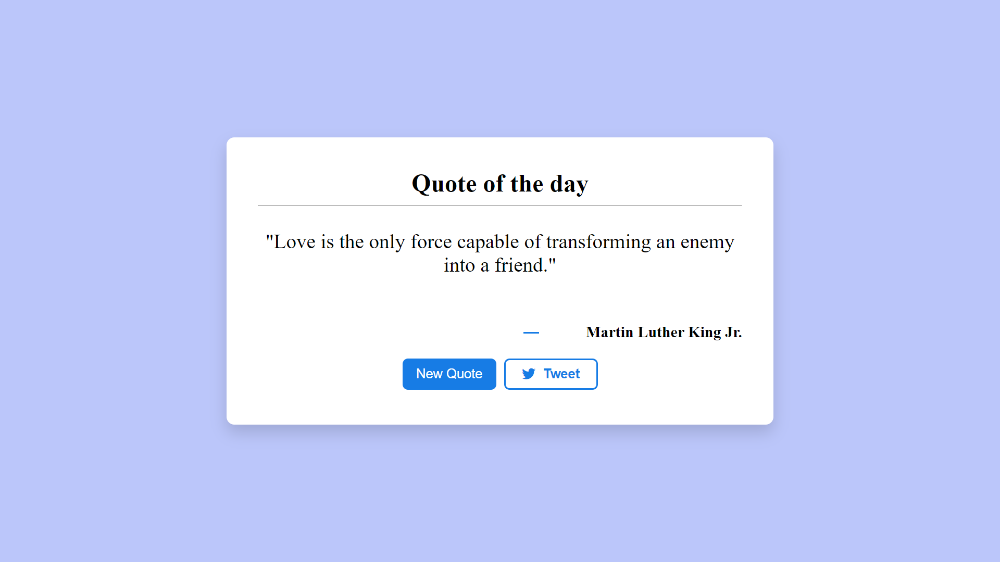
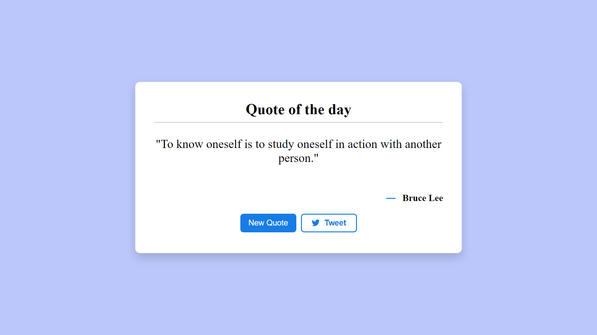

# Quote of the Day

This is a simple web application that provides users with a daily dose of inspiration by displaying a random quote each day. Whether you need a motivational boost, a moment of reflection, or simply enjoy the beauty of words, this application aims to brighten your day with thought-provoking and uplifting quotes from a diverse range of authors.

With a clean and intuitive interface, users can effortlessly access a new quote of the day with the click of a button. Additionally, the application offers seamless integration with Twitter, allowing users to share their favorite quotes and spread inspiration with their friends and followers.

## Features

- Displays a random quote of the day.
- Allows users to fetch a new random quote with the "New Quote" button.
- Enables users to share the displayed quote and its author on Twitter with the "Tweet" button.

## Technologies Used

- HTML
- CSS
- JavaScript
- Quotable API

## Demo

## New Quote

